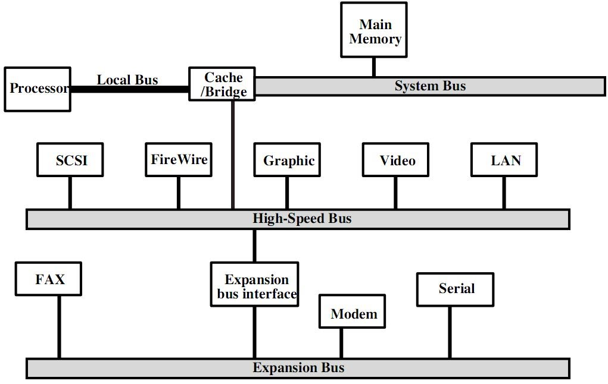
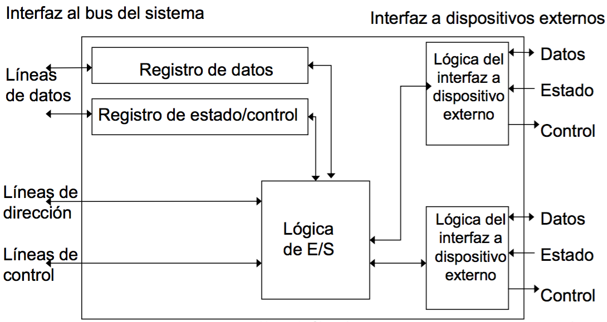

Final Arquitectura de Computadoras - Preguntas
==============================================

Interrupciones
--------------

1. Explique el mecanismo de interrupción.

2. Cual es la funcion de un controlador de interrupciones.

3. Describa las distintas fuentes de interrupción que conozca.

  - Programa: Generada por alguna condicion q se produce como resultado de la
    ejecucion de una instruccion (overflow, div / cero, iinstruccion fuera de
    espacio de memoria permitido).

  - Temporizacion: Generadas por un temporizador interno al procesador.

  - E/S: Generada por un controlador de E/S, para indicar la finalizacion sin
    problemas de una operacion o para avisar de ciertas condiciones de error.

  - Fallo de hardware: Fallo tal como una falta de potencia o un error de
    paridad en memoria.

4. Explique caracteristicas y tratamiento de interrupciónes multiples.

  Se pueden seguir dos alternativas para tratar las interrupciones múltiples.
  La primera es desactivar las interrupciones mientras se está procesando una
  interrupción. Una interrupción inhabilitada simplemente significa que el
  procesador puede y debe ignorar la señal de petición de interrupción. Se si
  produce una interrupción en ese momento, generalmente se mantiene pendiente,
  y será examinada por el procesador una vez ésta haya activado las
  interrupciones.

  El inconveniente de este sistema es que no tiene en cuenta la prioridad
  relativa. Es por eso que la segunda alternativa consiste en definir
  prioridades para las interrupciones, y permitir que una interrupción de
  prioridad más alta pueda interrumpir a un gestor de interrupción de prioridad
  menor.

Buses
-----

1. Que es un Bus, tipos de buses, temporizacion y metodos de arbitraje

      Un bus es un camino de comunicacion (hardware) entre dos o mas
      dispositivos.

      Tipos de buses:

      * Dedicado: Una linea de bus dedicada esta permanentemente asignada a
        una funcion o a un subconjunto fisico de componentes de computador.

      * Multiplexado: en un bus multiplexado se transmiten tanto los datos
        como las direcciones por la misma via, impidiendo que las transmisiones
        puedan hacerse en paralelo. Tambien implica el uso de una señal extra.

      Metodos de arbitraje:

      * Centralizado: Un unico dispositivo de hardware (arbitro o controlador
        del bus) es responsable de asignar tiempos en el bus. Dicho dispositivo
        puede estar integrado en el procesador o ser un modulo separado.

      * Distribuido: Cada dispositivo cuenta con la logica necesaria para
        controlar el acceso al bus. Los modulos actuan conjuntamente para
        compartir el bus.

      En ambos metodos el proposito es designar un dispositivo (procesador o
      odulo E/S) como maestro, el cual podra iniciar una transferencia de datos
      on otro dispositivo (esclavo).

      Temporizacion:

      El termino temporizacion hace referencia a la forma en la que se
      coordinan los eventos en el bus. Los buses utilizan temporizacion
      sincrona o asincrona.

      * Sincrona: la presencia de un evento esta dada por un reloj.
      * Asincrona: la presencia de un evento en el bus es consecuencia y
        __depende__ de que se produzca un evento previo.

      Anchura del Bus: afecta las prestaciones del sistema: cuanto mas ancho es
      el bus de datos, mayor es el nro de bits que se transmiten a la vez. con
      respecto a la anchura del bus de direcciones: cuanto mas ancho sea, mayor
      es el rango de posiciones que se puede referenciar.

2. Jerarquia de buses.

  Si se conecta un gran número de dispositivos al bus, las prestaciones pueden
  disminuir. Hay dos causas principales:

  1. Cuanto más dispositivos se conectan al bus, mayor es el retardo de propagación.

  2. El bus puede convertirse en un cuello de botella a medida que las peticiones de transferencia acumuladas se aproximan a la capacidad del bus. Sin embargo, este problema se puede resolver, por ejemplo, incrementando el bus de datos.

  Por consiguiente, la mayoría de las computadoras utilizan varios buses,
  normalmente organizados jerárquicamente.

  Una estructura típica es donde hay un bus local que conecta el procesador a
  la memoria cache. El controlador de memoria cache conecta la cache no sólo al
  bus local, sino también al bus del sistema, donde se conectan todos los
  módulos de memoria principal. Es posible conectar controladores de E/S
  directamente al bus del sistema. Una solución más eficiente consiste en
  utilizar uno o más buses de expansión. La interfaz del bus de expansión
  regula las transferencias de datos entre el bus del sistema y los
  controladores conectados al bus de expansión. Esta disposición permite
  conectar al sistema una amplia variedad de dispositivos de E/S.

  Esta arquitectura de buses tradicional es razonablemente eficiente, pero
  muestra su debilidad a medida que los dispositivos de E/S ofrecen
  prestaciones cada vez mayores. La respuesta a esta situación, ha sido
  proponer un bus de alta velocidad.

  En este caso, hay un bus local que conecta el procesador a un controlador de
  cache, que a su vez está conectado al bus de sistema que soporta a la memoria
  principal. El controlador de cache está integrado junto con el adaptador, que
  permite la conexión al bus de alta velocidad. Éste último es un bus diseñado
  específicamente para conectar dispositivos de E/S de alta capacidad. Los
  dispositivos de velocidad menor pueden conectarse al bus de expansión, que
  utiliza una interfaz para adaptar el tráfico entre el bus de expansión y el
  bus de alta velocidad.

  La ventaja de esta organización es que el bus de alta velocidad acerca al
  procesador los dispositivos que exigen prestaciones elevadas, y al mismo
  tiempo, es independiente del procesador.

  

3. Mencione diferencias entres bus PCI y bus SCSI.

E/S - DMA
---------

* Como es la estructura de un modulo de E/S.

  

  Un modulo de E/S cuenta con dos interfaces, una interna y otra externa
  Contiene la logica necesaria para comunicar al procesador con otros
  dispositivos de forma simplificada. Dependiendo del nivel de abstraccion que
  le presente el modulo de E/S al procesador puede ser considerado un canal o un
  procesador de E/S (alto nivel de abstraccion) o un controlador de E/S (posee
  menos logica por lo cual presenta un menor nivel de abstraccion). Un modulo
  de E/S cuenta con una interfaz para comunicarse con el procesador en la cual
  recibira por un bus de datos el dispositivo al cual quiere comunicarse y la
  cantidad de palabras que espera recibir. dicha informacion es guardada en
  registros de datos y control respectivamente, los cuales funcionan como buffer
  en caso q el modulo E/S se encuentre atendiendo un requerimiento previo.
  Por medio de un bus de control recibira seniales acerca de la operacion
  requerida (lectura/escritura). Por ultimo, esta interfaz cuenta con un bus de
  direcciones por donde se recibira la direccion a utilizar para la transaccion.

* Describa las posibles tecnicas que pueden utilizarse para realizar las
operaciones de E/S

  Tanto con E/S programada como con interrupciones el procesador es responsable
  de extraer los datos de la memoria principal en una salida y de almacenar los datos
  en la memoria principal en una entrada.

  * E/S Programada: el procesador ejecuta un programa q controla directamente
    la operacion de E/S, inlcuyendo la comprobacion de estado del dispositivo,
    el envio de una orden de lectura o escritura, asi como tambien la
    transferencia del dato. cuando el procesador envia una orden al modulo de
    E/S debe esperar hasta q la operacion concluya (pierde este tiempo).

  * E/S Mediante interrupciones: el procesador proporciona la orden de E/S, continua
    ejecutando otras instucciones y es interrumppido por el modulo de E/S
    cuando este ha terminado su trabajo.

  * E/S via DMA: el modulo E/S y la memoria principal intercambian datos
    directamente, sin la intervencion del procesador.

* Caracteristicas funcionales de DMA.

Cache
-----

1. Describa que se debe tener en cuenta para diseñar una cache(TODO).

El objetivo de la memoria cache es lograr que la velocidad de la memoria sea lo
mas rapida posible, consiguiendo al mismo tiempo un tamaño grande al precio de
memorias semiconductoras menos costosas.

Propiedades a cumplir
* Inclusión: Los datos almacenados en un nivel han de estar almacenados en los
  niveles inferiores a él
* Coherencia: Las copias de la misma información en los distintos niveles deben
  contener los mismos valores.

Tamaño de Cache: si bien es tentador incrementar el tamaño de la cache para
mejorar las prestaciones, nos vemos restringidos no solo por los elevados
costos sino tambien por otras limitaciones como por ejemplo el hecho que las
memorias caches mas grandes tienden a ser mas lentas que otras mas pequeñas
manufacturadas con los mismos materiales e incluso ubicadas en los mismos
lugares. esto se debe a que al incrementar el tamaño tambien incrementa el
circuiterio necesario para comunicarlas.
Es imposible predecir un tamaño **optimo** ya que las prestaciones de una
memoria cache son muy sensibles a las tareas desempeñadas por la misma.

Funciones de correspondencia:

  * Directa: Consiste en hacer corresponder cada bloque de memoria principal a
  solo una linea de cache. es la tecnica mas sencilla. se implementa facilmente
  utilizando la direccion. desde el punto de vista del acceso a cache, cada
  direccion de memoria principal puede verse como dividida en tres campos: etiqueta,
  linea, palabra. Su principal desventaja es que hay una posicion concreta de
  cache para cada bloque dado.(dar ejemplo de thrashing)

  * Asociativa: Supera las desventajas de la directa permitiendo que cada bloque
  de memoria principal pueda cargarse en cualquier linea de la cache. La direccion
  de memoria se interpreta tan solo como una etiqueta y un campo de palabra. el
  campo de etiqueta identifica univocamente un bloque de memoria principal y para
  determinar si se encuentra en la cache se examina simultaneamente todas las
  etiquetas de lineas. esto marca su principal desventaja ya que para lograr dicha
  busqueda en paralelo se precisa circuiteria de mayor cantidad y en mayor
  cantidad.

  * Asociativa por conjuntos: Es un hibrido entra la directa y la asociativa, es
  decir, recoge las aspectos positivos de ellas sin presentar sus desventajas.
  en este caso la direccion nuevamente se divide en tres campos, los cuales
  referencian etiqueta, conjunto, palabra. con este metodo la etiqueta es mucho
  mas corta y solo se compara con las etiquetas del conjunto al que pertenece.

  Algoritmos de sustitucion:

  * FIFO: El primero en entrar sera el primero en salir.
  * LRU (Least Recently Used): Se sustituye el bloque que se ha mantenido en la
      cache por mas tiempo sin haber sido referenciado.
  * LFU (Least Frequently Used): Se sustituye aquel bloque del conjunto que ha
      experimentado menos referencias.
  * RANDOM: Se toma una linea al azar. Sorprendentemente presenta prestaciones
      ligereamente menores a las de los anteriores algoritmos.

  Politicas de Escritura: antes de que pueda ser reemplazado un bloque q este
  en una linea de cache es necesario comprobar si se ha alterado en cache pero
  no en memoria principal. si no lo ha sido, puede escribirse sobre la cache. si ha
  sido modificado esto significa que se ha realizado al menos una operacion de
  escritura sobre una palabra, lo cual implica que dicha informacion debe ser
  actualizada en memoria principal.

    * Inmediata: la operacion de escritura se hace tanto en cache como en
    memoria principal. Desventajas: genera trafico sustancial a memoria.

    * Post Escritura: las actualizaciones se hacen solo en cache. cuando tiene
    lugar una actualizacion se activa un bit 'actualizar' asociado a la linea.
    cuando el bloque es sustituido, se comprueba el estado de dicho bit para
    definir si debe ser actualizado en memoria principal. Desventajas: el bloque
    de memoria principal se mantiene desactualizado, obligando a modulos de E/S a
    acceder a memoria a traves de la cache, lo cual complica la circuiteria y
    genera potencialmente un cuello de botella.

Tamaño de línea.

Cuando se recupera y ubica en caché un bloque de datos, se recuperan no sólo
la palabra deseada, sino además algunas palabras adyacentes. A medida que
aumenta el tamaño de bloque, la tasa de aciertos primero aumenta debido al
principio de localidad y más datos útiles son llevados a la caché. Sin
embargo, la tasa de aciertos comenzará a decrecer.

Dos efectos concretos entran en juego:

  *  Bloques más grandes reducen el número de bloques que caben en la caché.

  * A medida que un bloque se hace más grande, cada palabra adicional está
  más lejos de la requerida, y por tanto es más improbable que sea necesaria a
  corto plazo.

Un tamaño entre 4 y 8 unidades direccionables parece estar razonablemente
próximo al óptimo número de cachés.

Cuando se introdujeron originalmente las cachés, un sistema tenía sólo una
caché. Más recientemente, se ha convertido en una norma el uso de múltiples
cachés.

Ha sido posible tener una caché en el mismo chip del procesador, reduciendo
la actividad del bus externo del procesador y los tiempos de ejecución e
incrementando las prestaciones globales de sistema. Cuando la instrucción o
dato requeridos se encuentran en la caché on-chip, se elimina el acceso al bus.
Los accesos a la caché on-chip se efectúan apreciablemente más rápidos que
los ciclos de bus y durante ese período el bus está libre para realizar otras
transferencias.

Los diseños más actuales incluyen tanto caché on-chip como externa. La
estructura resultante se conoce como caché de dos niveles. Si no hay caché 2
y el procesador hace una petición de acceso a una posición de memoria que no
está en la caché 1, entonces el procesador debe acceder a la RAM o la ROM a
través del bus, obteniendo bajas prestaciones.

Si se utiliza una caché 2, entonces, con frecuencia, la información puede
recuperarse fácilmente. La mejora potencial del uso de una caché de dos
niveles depende de las tasas de aciertos en ambas cachés. En general, el uso de
un segundo nivel de caché mejora las prestaciones.

¿Unificada o partida?

Al principio, se usaba una sola caché para almacenar las referencias, tanto a
datos como a instrucciones. Actualmente se ha hecho normal separar la caché en
dos: una dedicada a instrucciones y otra a datos.

Una caché unificada tiene varias ventajas potenciales:

* Para un tamaño dado de caché, una unificada tiene una tasa de aciertos mayor
que una partida, ya que nivela automáticamente la carga entre captación de
instrucciones y de datos.

* Sólo se necesita diseñar e implementar una caché.

La ventaja del diseño de caché partida es que elimina la competición por la
caché entre el procesador de instrucciones y la unidad de ejecución. Esto es
importante en diseños que cuentan con segmentación de cauce de instrucciones.
Esta disputa por la caché puede degradar las prestaciones, interfiriendo con el
uso eficiente del cauce segmentado de instrucciones. La caché partida supera
esta dificultad.

* Describa algoritmos de ubicacion y politica de escritura en cache.
* Funciones de correspondencia entre memoria y memoria cache. Politicas de
  escritura desde el punto de vista de la coherencia de datos.
* Describa las tecnicas de reemplazo de bloque, correspondencia y politicas
* Analice ventajas y desventajas de tener varios niveles de cache.
  de escritura en memoria cache.

Segmentacion de Cauce
---------------------

1. Que es la segmentacion de cauce.

  > La segmentación de cauce (pipelining) es una forma particularmente
  > efectiva de organizar el hardware de la CPU para realizar más de una
  > operación al mismo tiempo. Consiste en descomponer el proceso de
  > ejecución de las instrucciones en fases o etapas que permitan una
  > ejecución simultánea. Explota el paralelismo entre las instrucciones de
  > un flujo secuencial.

  Motivos de retardo de cauce.

  * Estructurales: Provocados por conflictos por los recursos
    ej: Dos o mas instrucciones necesitan utilizar el mismo recurso
    hardware en el mismo ciclo. (IF y MA con memoria unificada)

  * Por dependencia de datos: Ocurren cuando dos instrucciones se comunican
    por medio de un dato (ej.: una lo produce y la otra lo usa) ej:
    Condición en la que los operandos fuente o destino de una instrucción
    no están disponibles en el momento en que se necesitan en una etapa
    determinada del cauce.

    * Lectura después de Escritura (RAW, dependencia verdadera): una
    instrucción genera un dato que lee otra posterior
    * Escritura después de Escritura (WAW, dependencia en salida): una
    instrucción escribe un dato después que otra posterior sólo se da si se
    deja que las instrucciones se adelanten unas a otras
    * Escritura después de Lectura (WAR, antidependencia): una instrucción
    modifica un valor antes de que otra anterior que lo tiene que leer, lo
    lea. ( no se puede dar en nuestro cauce simple )

  * Por dependencia de control: Ocurren cuando la ejecución de una
    instrucción depende de cómo se ejecute otra (ej.: un salto y los 2
    posibles caminos)

2. Que ventajas proporciona su implementacion.

3. Describa los metodos y tecnicas utilizadas para disminuir o evitar las
   paradas que afectaran al funcionamiento de los cauces.

  Soluciones a riesgos estructurales:
  Duplicación de recursos hardware
  - Sumadores o restadores además de la ALU
  - Separación en memorias de instrucciones y datos
  - Turnar el acceso al banco de registros
  - Escrituras en la 1o mitad de los ciclos de reloj • Lecturas en la 2o mitad de los ciclos de reloj
  Soluciones a riesgos de datos:
  Para riesgos RAW: se debe determinar cómo y cuando aparecen esos riesgos

    * por hardware: adelantamiento de operandos. consiste en pasar directamente
      el resultado obtenido con una instrucción a las instrucciones que lo
      necesitan como operando.
      * por software: uso de instrucciones NOP o reordenamiento de instrucciones.
      es ejecutada por el compilador. evita los riesgos reordenando las
      instrucciones del código sin afectar los resultados

    - Soluciones a riesgos de Control:
    - para saltos incondicionales la unica solucion es resolver lo mas
        rapidamente posible la direccion de la proxima instruccion a ejecutar.
    - para saltos condicionales es mas complejo ya que se depende del resultado
        de la instruccion anterior para determinar el orden de ejecucion.

    Soluciones:
      - Flujos Multiples
      - Precaptar el destino del salto
      - Buffer de bucles
      - Prediccion de saltos
      - Salto retardado

    - Precaptar el destino del salto: (hardware) una solucion sencilla es adelantar la
        resolucion de la direccion de salto a la misma etapa de decode,
        donde ya se puede definir q una operacion es de salto. con este
        metodo se reduce la cantidad de paradas del cauce a solamente una.

    - Flujos Multiples: (hardware)
        Varios cauces (uno por cada opción de salto). •
        Precaptan cada salto en diferentes cauces.
        • Se debe utilizar el cauce correcto.
        • Desventajas:
        • Provoca retardos en el acceso al bus y a los registros.
        • Si hay múltiples saltos, se necesita un mayor número de cauces.

    - Buffer de bucles: (hardware)
        un buffer de bucles es una memoria pequeña de gran velocidad,
        gestinoada por la etapa de captacion de instruccion. contiene,
        secuencialmente las n instrucciones captadas mas recientemente. si
        se va a producir un salto, el hardware comprueba en primer lugar si
        el destino de salto esta en el buffer.

    - Salto retardado (software): se pueden mejorar las prestaciones de un
        cauce reordenando automaticamente las instrucciones de un programa
        de forma que las instrucciones de salto tengan lugar despues de lo
        realmente deseado.

    - Prediccion de saltos:
        soluciones estaticas:
        - predecir q nunca se salta: supone q el salto no se producira y continuara captando instrucciones secuencialmente.
        - predecir q siempre se salta: supone q el salto se producira y siempre captara la instruccion destino del salto.
        - predecir segun el codigo de operacion: el procesador asume que el salto se producira para ciertos codigos de operacion de bifurcacion y no para otros.
        soluciones dinamicas:
        buscan mejorar la exactitud de la prediccion, registrando la
        historia de las instrucciones de bifurcadcion condicional en un
        programa. A cada instruccion se le asocian uno o mas bits q
        reflejen su historia reciente. dichas instrucciones pueden ser
        guardadas en la memoria cache o alguna memoria rapida dedicada.
        - conmutador saltar/no saltar: el procesador referencia los bits asociados a la instruccion para tomar una desicion al momento de captar la proxima instruccion.
        - Tabla de historia de salto: similar a la tecnica previa pero agrega tmb a la tabla la direccion de la proxima instruccion o incluso puede guardar directamente la instruccion a ejecutar.

* Cuanto mejora el rendimiento?

  > El máximo rendimiento  teorico es completar una instrucción con cada
  > ciclo de reloj.
  > Incrementa la productividad (throughput), pero no reduce el tiempo de
  > ejecución de la instrucción

Procesamiento Paralelo.
-----------------------

  Una manera tradicional de incrementar las prestaciones de un sistema consiste
  en utilizar varios procesadores que puedan ejecutar en paralelo una carga de
  trabajo dada. Las dos organizaciones de multiples procesadores mas comunes
  son los multiprocesadores simetricos (SMP) y los _clusters_. Recientemente, los
  sistemas de acceso no uniforme a memoria (NUMA) han aparecido comercialmente.

  SMP: Es un computador constituido por varios procesadores similares,
  interconectados mediante un bus o algun tipo de estructura de conmutacion. El
  problema mas critico a resolver en un SMP es la coherencia de cache. Cada
  procesador tiene su propia cache, y es psible que una linea de datos dada
  este presente en mas de una cache. Si esa linea se altera en una, entonces
  tanto la memoria principal como las otras caches tienen veersiones no validas de
  dicha linea.

  Multiprocesador Monochip: en un unico chip se implementan varios
  procesadores. Un diseño  relacionado consiste en repetir algunos componentes
  de un procesador para que este pueda ejecutar varias hebras concurrentemente
  (Procesador Multihebra).

  Cluster: es un grupo de computadores completos interconectados y trabajando
  juntos como un solo recurso de computo, proporcionando la ilusion de ser una
  unica maquina. El termino _computador completo_ significa que puede funcionar
  autonomamente, fuera del cluster.

  * Describa las caracteristicas que diferencian los SMTP respecto a los
    clusters
  * Caracteristicas de los clusters.
  * ¿Qué características posee un procesador supersegmentado frente a un
    superescalar?
  * Que caracteristicas posee un multiprocesador simetrico (SMP)?

Repertorio de instrucciones
---------------------------

1. Describa las caracteristicas que diferencian los procesadores RISC de los
   CISC.

Subrutinas
----------

1. Metodos de Pasaje de argumentos a las funciones/procedimientos. Que sucede
   cuando tenemos varias subrutinas anidadas?
2. Describa el funcionamiento y uso de la pila.

  > Es un conjunto ordenado de elementos en el que solo uno de ellos es
  > accesible en un instante dado (Estructura LIFO), las operaciones posibles
  > son:  PUSH, POP
  > El control de la pila se lleva mediante direcciones comunmente denominadas:

    * Stack Pointer: contiene la direccion del tope (cabecera) de la pila
    * Base Pointer: contiene la direccion inicial de la pila
    * Limite: contiene la direccion maxima utilizable del bloque de memoria
        reservado

2. Metodos de Pasaje de argumentos a las funciones/procedimientos. Que sucede
   cuando tenemos varias subrutinas anidadas?

  Metodos de Pasaje de argumentos:
  * Por Registros: es el metodo mas facil de implementar, los datos se
  guardan en los registros  y se llama a la subrutina, la cual podra
  accederlos directamente. La principal limitacion es la cantidad de
  argumentos q se pueden pasar ya que esta intrinsecamente relacionado a
  la cantidad de registros disponibles.

